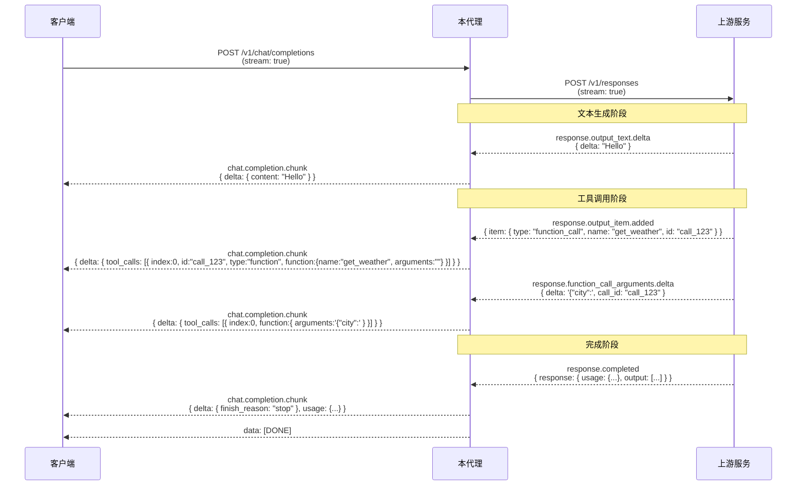

# Chat Completions to Responses Proxy

一个本地兼容代理：对外提供 OpenAI 风格的 `/v1/chat/completions`，并额外提供 `/v1/models` 与 `/v1/usage`；内部把 Chat Completions 请求转换成 Responses API 请求，再把 Responses 的流式事件整理回 Chat Completions 响应。

## 重要注意事项

本项目目前提供以下本地接口：

- `POST /v1/chat/completions`: 主转换链路，转发到上游 `/v1/responses`
- `GET /v1/models`: 返回上游模型列表；如果上游不可用则返回内置兜底模型
- `GET /v1/usage`: 返回本代理进程累计的 token 用量统计
- `GET /health`: 健康检查

它不会代理 `/v1/responses`、`/v1/embeddings` 或其他 OpenAI API 路径。

默认启动脚本只监听 `127.0.0.1`。如果你显式改成 `0.0.0.0` 或 `::`，必须设置 `LOCAL_API_KEY`，否则脚本会拒绝启动。

Codex 模式会读取本机 `.codex/auth.json` 中的登录令牌，只适合本机自用。不要把该文件、运行日志、终端输出或截图发布到公开仓库。

## 文件说明

- `chat-completions-to-responses-proxy.js`: 代理主程序。
- `start-chat-proxy.local.ps1`: Windows PowerShell 启动普通 Responses 上游模式。
- `start-chat-proxy.local.sh`: macOS/Linux 启动普通 Responses 上游模式。
- `start-chat-proxy-codex.local.ps1`: Windows PowerShell 启动 Codex 上游模式。
- `start-chat-proxy-codex.local.sh`: macOS/Linux 启动 Codex 上游模式。
- `test-chat-proxy.js`: 不使用真实 API key 的端到端冒烟测试。
- `package.json`: npm 脚本和发布元数据。
- `.gitignore`: 默认忽略本地密钥、日志和 PID 文件。
- `LICENSE`: MIT 许可证。

## 工作原理

本代理的核心功能是将 OpenAI Chat Completions API 格式的请求转换为 Responses API 格式，并将响应事件流转换回 Chat Completions 格式。

### 请求格式转换规则

#### 消息角色映射

| Chat Completions 角色 | Responses API 目标位置 | 转换方式 |
|---------------------|----------------------|---------|
| `system` / `developer` | `instructions` 字段 | 多条 system/developer 消息的文本内容拼接为 `\n\n` 分隔的指令字符串 |
| `user` | `input` 数组 | 内容转换为 `input_text` 类型 |
| `assistant` | `input` 数组 | 内容转换为 `output_text` 类型 |
| `tool` / `function` | `function_call_output` 或 `input` | 有 `tool_call_id` 时转为 function call 输出；否则包装为 user content 并标记缺失 ID |

#### 内容类型转换

```
输入类型 (Chat Completions)          →  输出类型 (Responses API)
─────────────────────────────────────────────────────────────
纯文本字符串                          →  input_text / output_text
{ type: "text", text: "..." }        →  input_text / output_text
{ type: "image_url", image_url:... }  →  input_image
{ type: "input_audio", ... }          →  input_audio
{ type: "file", ... }                 →  input_file
其他对象                              →  原样传递（保留原始结构）
```

#### 参数映射

| Chat Completions 参数 | Responses API 参数 | 备注 |
|--------------------|-------------------|------|
| `model` | `model` | 直接传递 |
| `messages[]` | `input[]` + `instructions` | 角色分类后重组 |
| `temperature` | `temperature` | Codex Strict 模式下移除 |
| `max_tokens` / `max_completion_tokens` | `max_output_tokens` | 取较大值；Codex Strict 模式下移除 |
| `top_p` | `top_p` | 直接传递 |
| `stream` | `stream` | 强制设为 `true`（内部始终使用流式） |
| `tools[]` | `tools[]` | `tool.function` 展平为顶层属性 |
| `tool_choice` | `tool_choice` | `{type:"function",name}` 格式标准化 |
| `response_format` | `text.format` | `json_schema` 类型特殊处理：内嵌 schema 合并到外层 |
| `reasoning_effort` | `reasoning.effort` + `reasoning.summary` | 自动填充 summary 为 `"detailed"` |
| `user` | `user` | 元数据字段直接传递 |
| `metadata` | `metadata` | 直接传递 |
| `store` | `store` | Codex Strict 模式强制为 `false` |
| `parallel_tool_calls` | `parallel_tool_calls` | 直接传递 |

### 响应格式转换规则

#### 流式事件映射（SSE）



#### Usage 字段映射

| Responses API 用量 | Chat Completions 用量 |
|-------------------|---------------------|
| `usage.input_tokens` | `usage.prompt_tokens` |
| `usage.output_tokens` | `usage.completion_tokens` |
| `usage.total_tokens` | `usage.total_tokens`（如缺失则自动计算） |

### 特殊处理逻辑

#### Codex Strict 模式

当 `UPSTREAM_MODE=codex` 且 `CODEX_STRICT=1` 时：

- ✅ `instructions` 字段确保非空（空时设为空字符串）
- ❌ 移除 `max_output_tokens` 参数
- ❌ 移除 `temperature` 参数
- ❌ 强制 `store = false`

#### 工具调用追踪机制

代理使用内部 `ToolCallTracker` 维护多个并发工具调用的状态：

1. **身份注册**：当收到 `response.output_item.added/done` 且 item 为 `function_call` 类型时，记录 `call_id`、`item_id` 等标识符
2. **参数累积**：通过 `response.function_call_arguments.delta` 事件增量追加参数字符串
3. **顺序保证**：确保 `identity` chunk 在 `arguments` chunk 之前发送给客户端
4. **去重合并**：相同调用 ID 的事件会合并到同一个 tracked 对象

#### 认证头构建差异

**Responses 模式：**
```http
Authorization: Bearer <UPSTREAM_API_KEY>
Content-Type: application/json
Accept: text/event-stream
```

**Codex 模式：**
```http
Authorization: Bearer <access_token>
chatgpt-account-id: <account_id>
OpenAI-Beta: responses=experimental
originator: codex_cli_rs
Content-Type: application/json
Accept: text/event-stream
```

Codex 模式支持从 JWT access token 中自动提取 `account_id`（如果未显式设置）。如果运行时显式提供了 `CODEX_REFRESH_TOKEN`，代理在收到 401/403 错误时会自动尝试刷新 token 并重试一次；仓库内置的 Codex 启动脚本默认故意不传入 refresh token，因此默认启动方式不会启用这条自动刷新路径。

## 环境要求

- Node.js 18 或更新版本。
- macOS/Linux 使用 `.sh` 脚本时，建议先执行：

```bash
chmod +x ./start-chat-proxy.local.sh ./start-chat-proxy-codex.local.sh ./test-chat-proxy.js
```

## 先跑测试

这个测试会临时启动一个假的 Responses 上游和本代理，验证 `/health`、本地鉴权、`/v1/chat/completions` 到 `/v1/responses` 的转换链路，以及 `/v1/models`、`/v1/usage` 的本地接口行为。

```bash
node ./test-chat-proxy.js
```

Windows PowerShell 也一样：

```powershell
node .\test-chat-proxy.js
```

如果使用 npm，也可以运行：

```bash
npm test
```

## Responses 上游模式

这个模式适合代理到一个兼容 `/v1/responses` 的服务。

### Windows

```powershell
$env:UPSTREAM_RESPONSES_URL = 'http://127.0.0.1:3000/v1/responses'
$env:UPSTREAM_API_KEY = ''
$env:LOCAL_API_KEY = 'local-dev-key'
.\start-chat-proxy.local.ps1 -Restart
```

如果你的上游 Responses 服务需要鉴权，把空字符串改成真实 key：

```powershell
$env:UPSTREAM_API_KEY = 'sk-...'
```

### macOS/Linux

```bash
export UPSTREAM_RESPONSES_URL='http://127.0.0.1:3000/v1/responses'
export UPSTREAM_API_KEY=''
export LOCAL_API_KEY='local-dev-key'
./start-chat-proxy.local.sh --restart
```

如果你的上游 Responses 服务需要鉴权，把空字符串改成真实 key：

```bash
export UPSTREAM_API_KEY='sk-...'
```

启动后默认监听：

```text
http://127.0.0.1:8787
```

可用接口示例：

```text
http://127.0.0.1:8787/v1/chat/completions
http://127.0.0.1:8787/v1/models
http://127.0.0.1:8787/v1/usage
http://127.0.0.1:8787/health
```

如果设置了 `LOCAL_API_KEY`，调用本地代理时也要带：

```bash
curl http://127.0.0.1:8787/v1/chat/completions \
  -H "Authorization: Bearer local-dev-key" \
  -H "Content-Type: application/json" \
  -d '{"model":"gpt-4.1-mini","messages":[{"role":"user","content":"ping"}]}'
```

查询模型列表示例：

```bash
curl http://127.0.0.1:8787/v1/models \
  -H "Authorization: Bearer local-dev-key"
```

查询本地累计用量示例：

```bash
curl http://127.0.0.1:8787/v1/usage \
  -H "Authorization: Bearer local-dev-key"
```

## Codex 上游模式

这个模式读取 Codex 登录文件里的 access token，不需要填写 `UPSTREAM_API_KEY`。

### Windows

```powershell
.\start-chat-proxy-codex.local.ps1 -Restart
```

### macOS/Linux

```bash
./start-chat-proxy-codex.local.sh --restart
```

可选参数：

```bash
./start-chat-proxy-codex.local.sh --restart --port 8787 --host 127.0.0.1 --auth-file "$HOME/.codex/auth.json"
```

如果需要走代理：

```bash
export PROXY_URL='http://127.0.0.1:7890'
./start-chat-proxy-codex.local.sh --restart
```

## API Key 填写注意事项

`UPSTREAM_API_KEY` 是代理访问上游 Responses 服务时使用的 key。默认可以留空；留空时代理不会向上游发送 `Authorization`。只有你的上游 Responses 服务要求鉴权时才填写。

`CODEX_CLIENT_ID` 是 Codex 上游模式里的客户端 ID 覆盖项。脚本会参考 `account_id` 的处理方式从 Codex auth 文件读取，不过来源是 `tokens.id_token`，并且原封不动传给代理主程序，不做 JWT 解析或字段提取。代理主程序不提供默认值。只有你明确知道要覆盖时才手动填写：

```powershell
$env:CODEX_CLIENT_ID = ''
```

```bash
export CODEX_CLIENT_ID=''
```

`LOCAL_API_KEY` 是客户端访问这个本地代理时使用的 key。监听 `127.0.0.1` 时它是可选的；如果你的监听地址是 `0.0.0.0` 或 `::`，启动脚本会要求必须设置 `LOCAL_API_KEY`。

不要把真实 API key 写进 README、提交记录、截图、聊天记录或会同步的脚本里。推荐在当前终端会话里临时设置环境变量，或者复制一份 `.local` 脚本只放在本机使用并加入 `.gitignore`。

如果 key 已经出现在公开位置，应该立即到对应服务商后台撤销并重新生成。

## 常用环境变量

- `PORT`: 本地监听端口，默认 `8787`。
- `HOST`: 本地监听地址，默认脚本使用 `127.0.0.1`。
- `LOCAL_API_KEY`: 本地代理鉴权 key，可选。
- `UPSTREAM_MODE`: `responses` 或 `codex`。
- `UPSTREAM_RESPONSES_URL`: 上游 Responses endpoint。
- `UPSTREAM_MODELS_URL`: 可选；显式指定上游模型列表 endpoint。不填时会根据 `UPSTREAM_RESPONSES_URL` 自动推导。
- `UPSTREAM_API_KEY`: 普通 Responses 上游模式的鉴权 key，可留空。
- `REQUEST_TIMEOUT_MS`: 上游请求超时，默认 `120000` 毫秒。
- `CODEX_CLIENT_ID`: Codex 上游模式的客户端 ID 覆盖项，可留空。
- `PROXY_URL`: 上游请求使用的 HTTP/HTTPS/SOCKS5 代理。
- `LOG_FILE`: 请求转换日志。
- `RAW_LOG_FILE`: 上游原始响应日志。

## 日志和 PID

脚本会在当前目录写入日志和 PID 文件，例如：

- `chat-completions-to-responses-proxy.requests.jsonl`
- `chat-completions-to-responses-proxy.upstream.jsonl`
- `chat-completions-to-codex-proxy.requests.jsonl`
- `chat-completions-to-codex-proxy.upstream.jsonl`
- `chat-proxy.out.log`
- `chat-proxy-codex.out.log`
- `chat-proxy.pid`
- `chat-proxy-codex.pid`

普通模式与 Codex 模式的 PowerShell 启动脚本现在都会输出 `log_file` 与 `raw_log_file`；Bash 脚本还会额外输出 `stdout_log`。

其中：

- `*.requests.jsonl` 记录转换后的请求与输出摘要
- `*.upstream.jsonl` 记录上游原始响应摘要
- `*.out.log` 是 Bash 启动脚本写入的 Node stdout/stderr 合并日志
- `*.pid` 记录启动脚本写入的代理进程 PID

这些文件通常属于本地运行产物，不建议提交到版本库。

仓库已经包含 `.gitignore`，默认忽略这些运行产物以及 `.env` 文件。发布前仍建议运行 `git status` 复查一次。

## 许可证

本项目使用 MIT License，详见 `LICENSE`。
